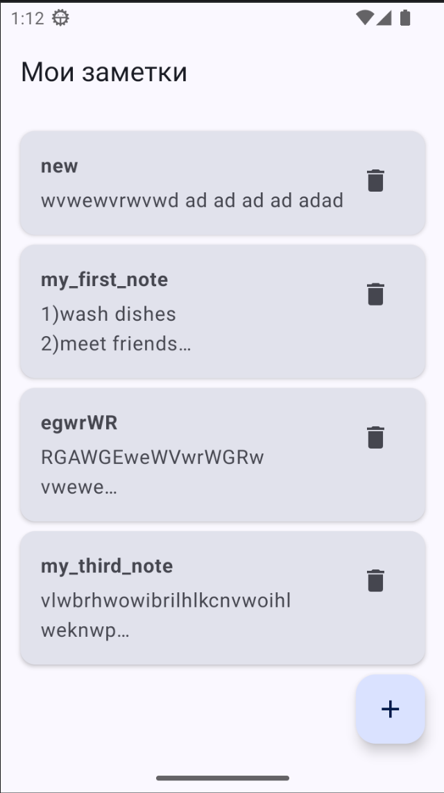
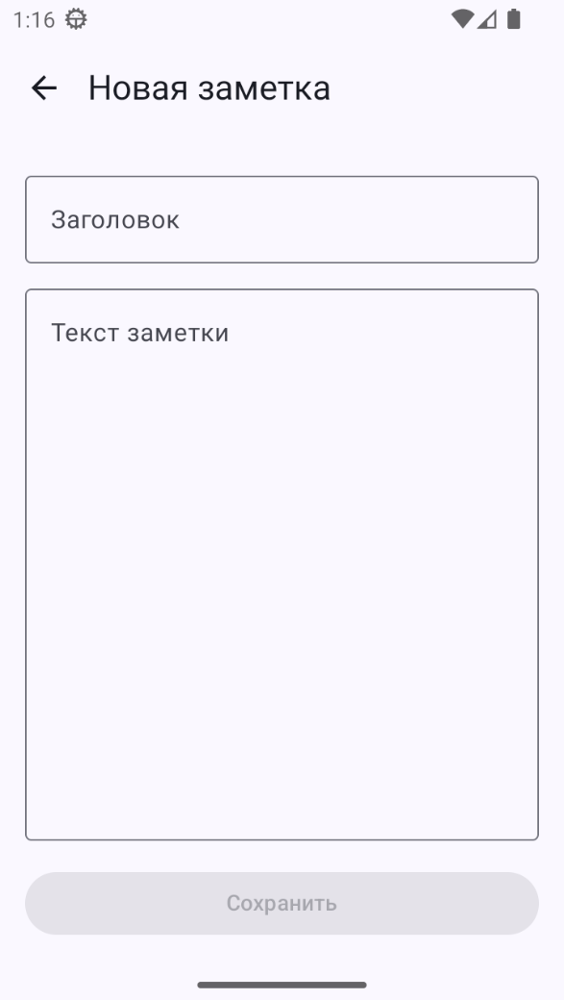
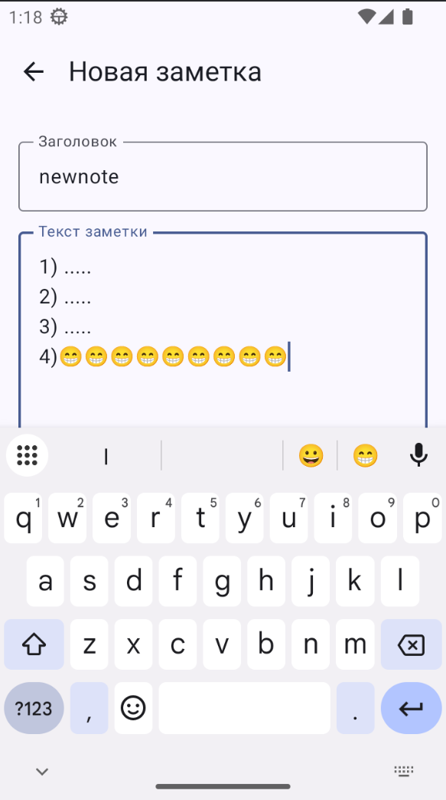
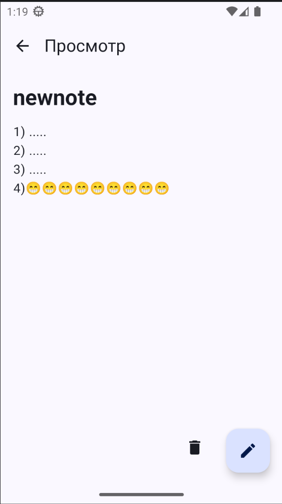

# Memo (Заметки)

Персональное Android-приложение для управления заметками. Проект реализован с использованием современного стека **Jetpack Compose** и локальной базы данных **Room**, следуя архитектурному паттерну **MVVM**.

## Основные возможности

- **Список заметок:** Отображение всех созданных записей с сортировкой по времени (сначала новые).
- **Просмотр и детализация:** Отдельный экран для чтения полного текста заметки.
- **Редактирование:** Возможность изменить заголовок или содержание уже существующей записи.
- **Удаление:** Быстрое удаление заметок как из списка, так и из экрана просмотра.
- **Локальное хранение:** Все данные сохраняются в SQLite через Room и не пропадают после закрытия приложения.

## Технологический стек

| Категория | Технология |
| :--- | :--- |
| **Язык** | Kotlin + Coroutines |
| **UI** | Jetpack Compose |
| **Архитектура** | MVVM (ViewModel + StateFlow) |
| **БД** | Room Persistence Library |

## Структура проекта

Проект организован по функциональным слоям:

```text
ru.nsu.badluev.memo
├── data/
│   ├── NoteDao.kt       # Интерфейс запросов к базе данных
│   ├── NoteDatabase.kt  # Конфигурация БД Room (Singleton)
│   └── NoteEntity.kt    # Описание таблицы "notes"
└── ui/
    ├── theme/           # Темы, цвета и шрифты Material 3
    ├── NoteViewModel.kt # Логика и связь UI с данными
    └── MainActivity.kt  # Точка входа и все Compose-экраны
```
## 📱 Скриншоты

<div align="center">
  
  
  
  
</div>
